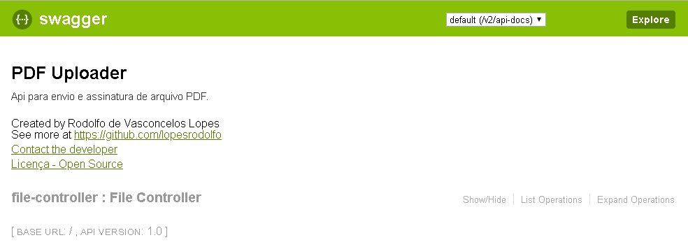
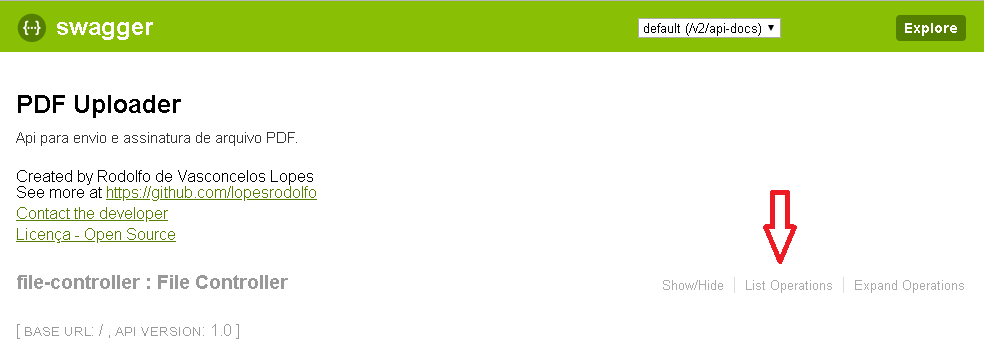

PDF Uploader
================================

O projeto consiste na implementação de um Web Service utilizando Java + SpringBoot. 

A aplicação permite que o usuário faça o envio de arquivos PDF juntamente com um CPF. Uma chave HASH a partir das informações de data e hora do servidor, cpf informado e ip do usuário será gerada, impressa no rodapé do arquivo PDF e o mesmo é armazenado no servidor.

Inicializando Aplicação
-------------

Inicie a aplicação a partir da classe "PdfUploaderApplication.java" executando como Java Aplication. O serviço estará disponível através do link http://localhost:8080/uploadFile.

Testando Com Swagger
---------

Com a aplicação executando, através do link http://localhost:8080/swagger-ui.html, a documentação completa do serviço  
estará disponível.

No link "List Operations" estará listado os métodos presentes no Web Service.

O arquivo salvo poderá ser acessado na pasta uploads existente na raiz do projeto.
